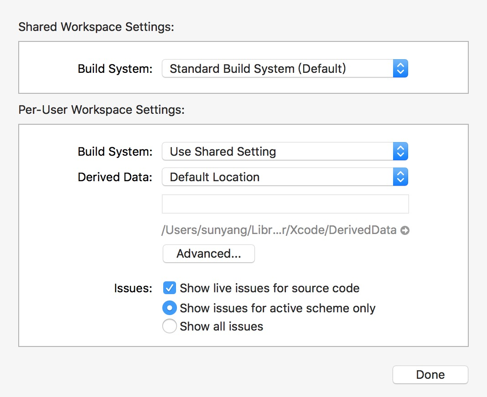

# Swift 编译时间优化

这篇文章整理了一些优化 Swift 项目编译时间的建议。

虽然 Swift 在不断的进步❤️.但是编译时间一直都是中大型项目不得不面临的问题。这个项目整理了一些能够减少编译时间的方法。

👷🏻作者: [Arek Holko](https://twitter.com/arekholko) 如果有需要补充的, **请提交 Issue 和 pull request！**


## 目录

* [函数和表达式中的类型检查](#函数和表达式中的类型检查)

- [Slowly compiling files](#slowly-compiling-files)
- [Build active architecture only](#build-active-architecture-only)
- [dSYM generation](#dsym-generation)
- [Whole Module Optimization](#whole-module-optimization)
- [Third-party dependencies](#third-party-dependencies)
- [Modularization](#modularization)
- [XIBs](#xibs)
- [Xcode Schemes](#xcode-schemes)
- [在 Xcode 中显示编译时间](#在 Xcode 中显示编译时间)
- [使用最新的 Xcode 编译系统](#使用最新的 Xcode 编译系统)


## 函数和表达式中的类型检查

Swift 编译时间变慢有一个重要的原因就是在类型检查中的巨大开销。默认情况下 Xcode 不会告诉你是那些代码让编译变慢的。你可以通过在 build settings 的 `Other Swift Flags` 添加以下内容来让这个功能跑起来:

- `-Xfrontend -warn-long-function-bodies=100` (这里的`100`指的是100毫秒, 你需要做的就是根据设备已经项目情况一点点的去调试这个值, 让他来满足你的需求。)
- `-Xfrontend -warn-long-expression-type-checking=100`


在编译一下你就能看到这样的警告了:


下一步就是找到这些代码然后对应的去修改了。[John Sundell](https://www.swiftbysundell.com/posts/improving-swift-compile-times) 和 [Robert Gummesson](https://medium.com/@RobertGummesson/regarding-swift-build-time-optimizations-fc92cdd91e31) 有一些研究来帮助你做这件事情。

⚠️ Warning:  这项技术不适用于那些选择了 Whole Module Optimization 的 target, 如果你打开了这个选项, 请暂时的关掉它。


📖参考资料:

- [Guarding Against Long Compiles](http://khanlou.com/2016/12/guarding-against-long-compiles/)
- [Measuring Swift compile times in Xcode 9 · Jesse Squires](https://www.jessesquires.com/blog/measuring-compile-times-xcode9/)
- [Improving Swift compile times — Swift by Sundell](https://www.swiftbysundell.com/posts/improving-swift-compile-times)
- [Swift build time optimizations — Part 2](https://medium.com/swift-programming/swift-build-time-optimizations-part-2-37b0a7514cbe)


# 编译慢的源文件

上一部分讲了在表达式和函数这个层面上优化编译时间的方法, 但是对整个文件来说又需要怎么做呢？

在 Xcode 里面没有相关的界面来做这个, 所以这部分需要用到命令行工具。

```sh
xcodebuild -destination 'platform=iOS Simulator,name=iPhone 8' \
  -sdk iphonesimulator -project YourProject.xcodeproj \
  -scheme YourScheme -configuration Debug \
  clean build \
  OTHER_SWIFT_FLAGS="-driver-time-compilation \
    -Xfrontend -debug-time-function-bodies \
    -Xfrontend -debug-time-compilation" | \
tee profile.log
```

(Replace `-project YourProject.xcodeproj` with `-workspace YourProject.xcworkspace` if you use a workspace.)

Then extract the interesting statistics using:

```sh
awk '/Driver Compilation Time/,/Total$/ { print }' profile.log | \
  grep compile | \
  cut -c 55- | \
  sed -e 's/^ *//;s/ (.*%)  compile / /;s/ [^ ]*Bridging-Header.h$//' | \
  sed -e "s|$(pwd)/||" | \
  sort -rn | \
  tee slowest.log
```

You’ll end up with `slowest.log` file containing list of all files in the project, along with their compile times. Example:

```
2.7288 (  0.3%)  {compile: Account.o <= Account.swift }
2.7221 (  0.3%)  {compile: MessageTag.o <= MessageTag.swift }
2.7089 (  0.3%)  {compile: EdgeShadowLayer.o <= EdgeShadowLayer.swift }
2.4605 (  0.3%)  {compile: SlideInPresentationAnimator.o <= SlideInPresentationAnimator.swift }
```

⚠️ Warning:  这项技术不适用于那些选择了 Whole Module Optimization 的 target, 如果你打开了这个选项, 请暂时的关掉它。

📖参考资料:

[Diving into Swift compiler performance](https://koke.me/2017/03/24/diving-into-swift-compiler-performance/)

# Build active architecture only

This setting is a default but you should double check that it’s correct. Your project should build only active architecture in Debug configuration.


📖 Sources:

- [What is Build Active Architecture Only](http://samwize.com/2015/01/14/what-is-build-active-architecture-only/)

  ​

## 生成 dSYM

Debug 下是默认不自动生成 dSYM 文件的。但是如果你需要

By default in new projects, dSYM files aren’t generated at all for Debug builds. However, it’s sometimes useful to have them available when running on a device – to be able to analyze crashes happening without the debugger attached.

Recommended setup:


📖 Sources:

- [Speeding up Development Build Times With Conditional dSYM Generation](http://holko.pl/2016/10/18/dsym-debug/)

  ​

# Whole Module Optimization

Another common trick is to:

- change `Optimization Level` to `Fast, Whole Module Optimization` for Debug configuration
- add `-Onone` flag to `Other Swift Flags` **only for Debug configuration**


What this does is it instructs the compiler to:

> It runs one compiler job with all source files in a module instead of one job per source file  
>
> Less parallelism but also less duplicated work  
>
> It's a bug that it's faster; we need to do less duplicated work. Improving this is a goal going forward  

Note that incremental builds with minimal changes seem to be a bit slower under this setup. You should see a vast speedup (2x in many projects) in a worst-case scenario, though.

📖 Sources:

- [Developear - Speeding Up Compile Times of Swift Projects](http://developear.com/blog/2016/12/30/Speed-Swift-Compilation.html)
- [Slava Pestov on Twitter: “@iamkevb It runs one compiler job with all source files in a module instead of one job per source file”](https://twitter.com/slava_pestov/status/911747257103302656)


## 第三方依赖

有两个方法可以用来带入三方的东西:

1. ​
2. 2

CocoaPods 是 iOS 中最有名的依赖管理工具

Carthage，虽然用起来很麻烦，但是如果你深受编译时间的折磨, 它倒是一个解决办法

📖 参考资料:

- time spent waiting for Xcode to finish builds 😅

There are two ways you can embed third-party dependencies in your projects:

1. as a source that gets compiled each time you perform a clean build of your project (examples: [CocoaPods](https://cocoapods.org), git submodules, copy-pasted code, internal libraries in subprojects that the app target depends on)
2. as a prebuilt framework/library (examples: [Carthage](https://github.com/Carthage/Carthage), static library distributed by a vendor that doesn’t want to provide the source code)

CocoaPods being the most popular [dependency manager](https://twitter.com/arekholko/status/923989580948402177) for iOS by design leads to longer compile times, as the source code of 3rd-party libraries in most cases gets compiled each time you perform a clean build. In general you shouldn’t have to do that often but in reality, you do (e.g. because of switching branches, Xcode bugs, etc.).

Carthage, even though it’s harder to use, is a better choice if you care about build times. You build external dependencies only when you change something in the dependency list (add a new framework, update a framework to a newer version, etc.). That may take 5 or 15 minutes to complete but you do it a lot less often than building code embedded with CocoaPods.

📖 Sources:

- time spent waiting for Xcode to finish builds 😅


## 模块化代码

Swift 的增量编译是很好的。有很多项目即使只是修改了一个字符串也需要将整个文件重新编译一边

为了避免这样的情况, 可以考虑将代码切割成多个模块。在iOS中有动态库和静态库。

比如说你的项目中有个一个比较底层的框架叫 `DatabaseKit`。 最有效的方法就是将

📖 参考资料:

- [Technical Note TN2435 – Embedding Frameworks In An App](https://developer.apple.com/library/content/technotes/tn2435/_index.html)
- [uFeatures


## XIB

Xib/storyboard 还是代码🔥 ，这一直是一个很热的话题, 今天我们不深入的了这个话题, 需要注意的是这点, 当你修改了某个 IB 的文件, 只有这个文件会被重新编译。但是如果是代码, 即使只是修改了基类共有方法的一行代码, 项目的很大一部分都会被重新编译。

📖 参考资料:

- [(…) in a large project incremental build is much faster if only a .xib was changed (vs. only a line of Swift UI code)](https://twitter.com/MichalCiuba/status/925326831074643968)

  ​

## App Schemes

就那一个最简单的项目来举例子吧,  它包含了下面三个 target :

- App
- AppTests
- AppUITests

只用一个也可以, 但是既然做了, 为什么不做的更好呢？这方面的设置有以下三个 scheme 组成

### App

Builds only the app on cmd-B. Runs only unit tests. Useful for short iterations, e.g. on a UI code, as only the needed code gets built.


### App - Unit Test Flow

Builds both the app and unit test target. Runs only unit tests. Useful when working on code related to unit tests, because you find about compile errors in tests immediately after building a project, not even having to run them!

This scheme is useful when your UI tests take too long to run them often.


### App - All Tests Flow

Builds the app and all test targets. Runs all tests. Useful when working on code close to UI which impacts UI tests.


📖 Sources:

- [All About Schemes](http://pilky.me/17/)

  ​

## 在 Xcode 中显示编译时间

做了这么多, 我们怎么样才能知道编译时间是不是得到了优化呢？可以在命令行工具中跑这段代码

```sh
$ defaults write com.apple.dt.Xcode ShowBuildOperationDuration -bool YES
```

然后在编译项目的时候, 就能看到这样的内容了:


建议每次比较的时候都在同样的状态下去分别编译, 比如这样:

1. 推出 Xcode
2. 清除数据( `$ rm -rf ~/Library/Developer/Xcode/DerivedData` )
3. 在 Xcode 中重新打开项目
4. 一打开 Xcode 或者是等 indexing 跑完了之后, 就编译一下。第一个可能更加接近真相，因为在 Xcode 9 中编译也要做 indexing 的事情。

或者，你也可以使用命令行来做这件事情:

```sh
$ time xcodebuild other params
```

📖 参考文件:

[How to enable build timing in Xcode? - Stack Overflow](https://stackoverflow.com/a/2801156/1990236)


## 使用最新的 Xcode 编译系统

苹果在 Xcode 9 中推出了[全新了编译系统](https://developer.apple.com/library/content/releasenotes/DeveloperTools/RN-Xcode/Chapters/Introduction.html#//apple_ref/doc/uid/TP40001051-CH1-SW878)。这是一个预览版，默认情况下是不开启的。

跟默认的编译系统相比，他的脚步是非常显著的。

在 Xcode 中 File - WorkSpace Settings 可以找到:



📖参考资料:

[Faster Swift Builds with the New Xcode Build System](https://github.com/quellish/XcodeNewBuildSystem)

- ](https://github.com/quellish/XcodeNewBuildSystem)


